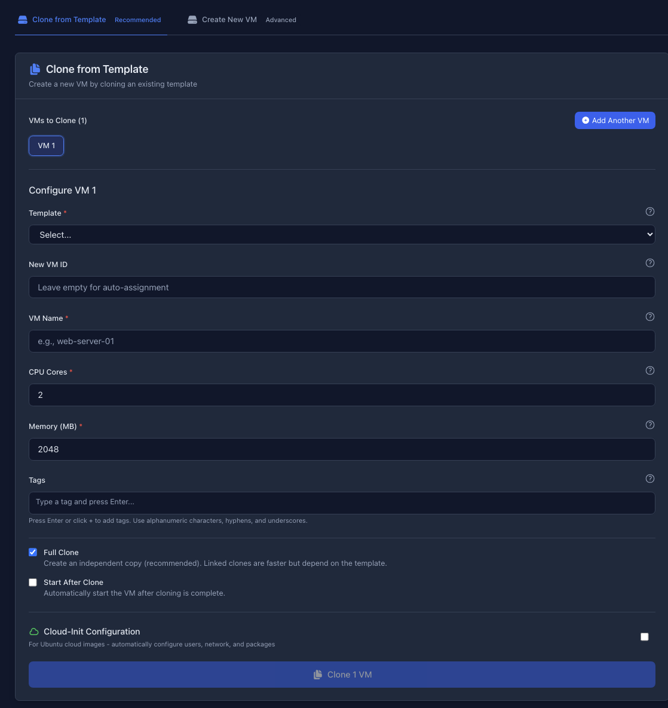
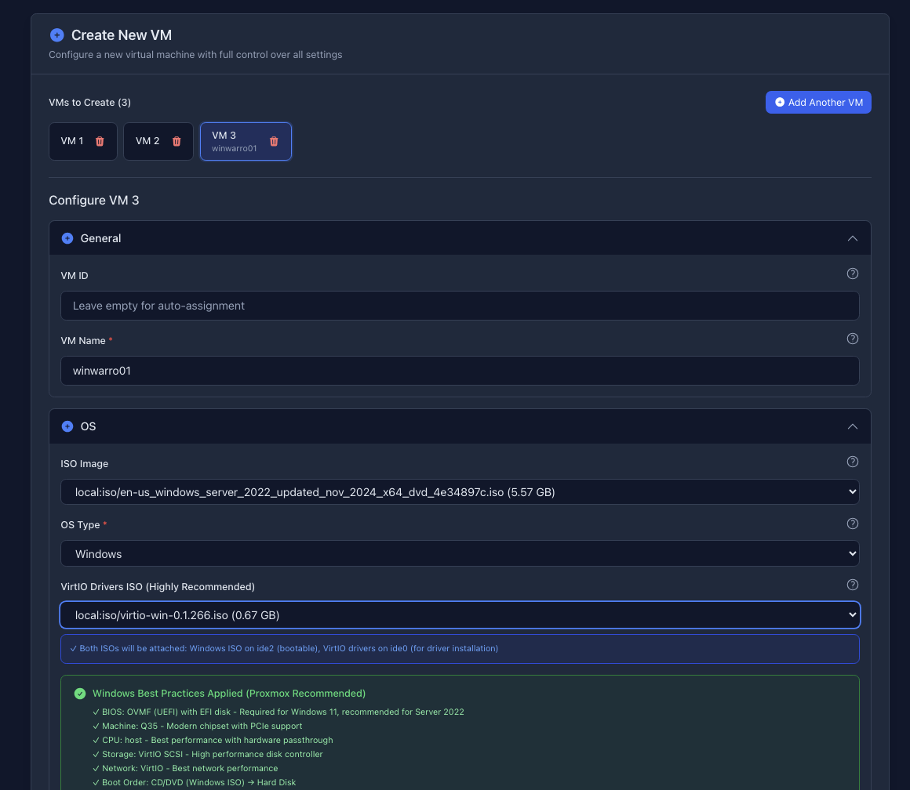

# Proxmox VM Deployer

A modern web interface for deploying and managing virtual machines on Proxmox VE. Simplifies VM deployment with template cloning, batch operations, and automated Windows best practices.




## Documentation

- **[Getting Started Guide](docs/GETTING_STARTED.md)** - Complete setup, installation, and usage instructions
- **[Cloud-Init Implementation Guide](docs/CLOUD_INIT_GUIDE.md)** - Automated VM configuration with cloud-init

## Features

- 🚀 **Template Cloning** - Deploy VMs from templates in seconds
- 🪟 **Windows Best Practices** - Automatic UEFI, VirtIO, and dual ISO configuration
- 📦 **Batch Deployment** - Create multiple VMs with a single click
- 🎨 **Modern UI** - Dark theme with real-time status updates
- ⚡ **Fast API** - Built with FastAPI and async operations
- 🐳 **Docker Ready** - Production deployment with Docker Compose
- 🔧 **Full Control** - Complete VM configuration (CPU, memory, disk, network)
- 🏷️ **Tagging System** - Organize VMs with custom tags
- 📝 **Audit Logging** - Complete audit trail in structured JSON format

## Quick Start

### Using Start Script (Development)

```bash
# Clone repository
git clone <repository-url>
cd Proxmox

# Configure backend
cp backend/.env.example backend/.env
nano backend/.env  # Add your Proxmox credentials

# Install dependencies (first time only)
cd backend && python3 -m venv venv && source venv/bin/activate && pip install -r requirements.txt && cd ..
cd frontend && npm install && cd ..

# Start everything
./start.sh
```

Access at: http://localhost:3001

### Using Docker Compose (Production)

```bash
# Clone repository
git clone <repository-url>
cd Proxmox

# Configure backend
cp backend/.env.example backend/.env
nano backend/.env  # Add your Proxmox credentials

# Start with Docker
docker-compose up -d
```

Access at: http://localhost:3001

## Architecture

```
┌─────────────────────────────────────────┐
│  React Frontend (Vite)                  │
│  • Template cloning & VM creation       │
│  • Batch deployment UI                  │
│  • Dark theme with Tailwind CSS         │
└──────────────┬──────────────────────────┘
               │ REST API
┌──────────────▼──────────────────────────┐
│  FastAPI Backend                        │
│  • Proxmox API integration              │
│  • Windows best practices automation    │
│  • Batch operations handler             │
└──────────────┬──────────────────────────┘
               │ Proxmoxer
┌──────────────▼──────────────────────────┐
│  Proxmox VE Server                      │
│  • VM templates                         │
│  • Storage pools & ISOs                 │
│  • Network configuration                │
└─────────────────────────────────────────┘
```

## Architecture Overview

## Use Cases

### Template Cloning
- Deploy pre-configured web servers in minutes
- Rapid development environment provisioning
- Consistent staging and testing infrastructure

### Windows VM Deployment
- **Automatic Configuration**: UEFI, Q35, VirtIO automatically configured
- **Dual ISO Support**: Windows + VirtIO drivers attached during creation
- **Best Practices**: Follows official Proxmox Windows recommendations
- **Step-by-Step Guidance**: In-app instructions for driver installation

### Batch Operations using Cloud-Init
- Deploy Kubernetes clusters (3+ nodes)
- Create multiple development environments
- Set up load-balanced web server pools


## Requirements

### Development
- Python 3.12+
- Node.js 20+
- Proxmox VE 7.0+ server

### Production (Docker)
- Docker 20.10+
- Docker Compose 2.0+
- Proxmox VE 7.0+ server

## Configuration

Create `backend/.env` with your Proxmox credentials:

```env
PROXMOX_HOST=192.168.1.150
PROXMOX_PORT=8006
PROXMOX_USER=root@pam
PROXMOX_PASSWORD=your_password
PROXMOX_VERIFY_SSL=false

DEFAULT_NODE=your_node_name
DEFAULT_STORAGE=local-lvm
DEFAULT_NETWORK_BRIDGE=vmbr0

VMID_MIN=100
VMID_MAX=999999
```

## Windows VM Deployment

### Automatic Best Practices
When you select "Windows" as OS type, the system automatically:
- ✅ Sets BIOS to OVMF (UEFI) with EFI disk
- ✅ Configures Q35 machine type (modern chipset)
- ✅ Uses VirtIO for storage and network (high performance)
- ✅ Sets CPU type to "host" (best performance)

### VirtIO Drivers Setup
1. Download VirtIO drivers ISO: https://fedorapeople.org/groups/virt/virtio-win/
2. Upload to Proxmox storage
3. Select both Windows ISO and VirtIO ISO in the form
4. During Windows installation, load VirtIO SCSI driver
5. After installation, run `virtio-win-guest-tools.exe`

Detailed instructions provided in the web interface.

## API Documentation

- **Swagger UI**: http://localhost:8000/docs
- **ReDoc**: http://localhost:8000/redoc
- **OpenAPI JSON**: http://localhost:8000/api/v1/openapi.json

## Troubleshooting

### Connection Failed
```bash
# Test backend health
curl http://localhost:8000/api/v1/health

# Test Proxmox connection
ssh root@192.168.1.150
```

### Templates Not Loading
```bash
# SSH to Proxmox and list VMs
ssh root@192.168.1.150
qm list
# Ensure templates have 'template' flag set
```

### Windows VM Won't Boot
- Verify OVMF (UEFI) is selected
- Check EFI disk is present (auto-created)
- Ensure Windows ISO is on ide2
- Verify boot order: ide2 → scsi0

## Commands Reference

### Development
```bash
./start.sh              # Start both backend and frontend
./stop.sh               # Stop both services
tail -f logs/backend.log   # View backend logs
tail -f logs/frontend.log  # View frontend logs
```

### Docker
```bash
docker-compose up -d              # Start services
docker-compose down               # Stop services
docker-compose logs -f            # View logs
docker-compose restart            # Restart services
docker-compose up -d --build      # Rebuild and start
docker-compose ps                 # View status
```

## Security Considerations

- 🔒 Use HTTPS in production (nginx reverse proxy)
- 🔑 Store credentials securely (use secrets management)
- 🛡️ Restrict API access to trusted networks
- 📊 Enable audit logging for all operations
- 🚫 Use non-root users in containers

## Contributing

1. Fork the repository
2. Create a feature branch
3. Make your changes
4. Test thoroughly
5. Submit a pull request

## License

MIT License - See LICENSE file for details

## Support

- **Documentation**: See [Getting Started Guide](docs/GETTING_STARTED.md) and [Cloud-Init Guide](docs/CLOUD_INIT_GUIDE.md)
- **Proxmox Wiki**: https://pve.proxmox.com/wiki/
- **Issues**: Report bugs and request features via GitHub Issues

---

**Happy Deploying! 🚀**
